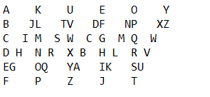

每日一练0525：给定整数序列， 求这个序列中子序列和的最大值

每日一练0526：编写函数，去除一个列表中不重复的元素，同时保持其顺序

每日一练0527：将一串数组以“Z 形”放入n个桶中

每日一练0528：在2000-3200中，找到所有可以被7整除，但不是5的倍数的整数。

每日一练0529：有四个数字：5，6，7，8，能组成多少不相同的，且不重复的三位数？

每日一练0530：任意输入n个整数，把这n个数从大到小（或者从小到大）输出

每日一练0530：鸡兔同笼，头35，脚94。问鸡和兔各有几只？
