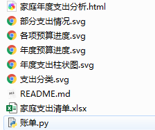
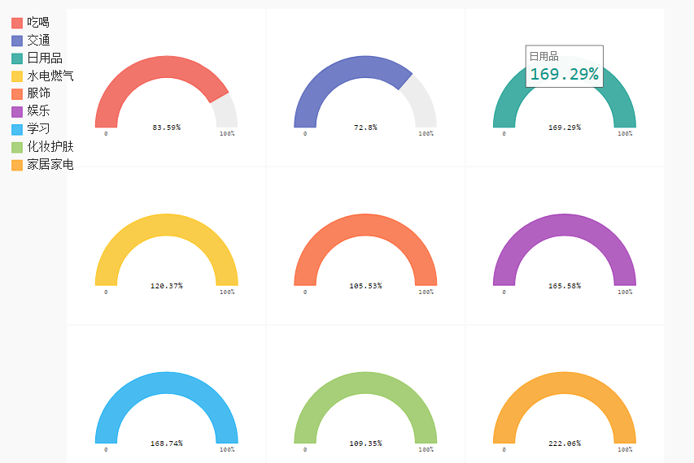
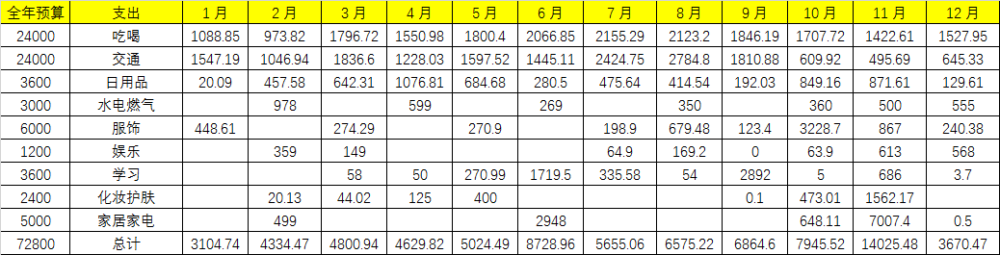
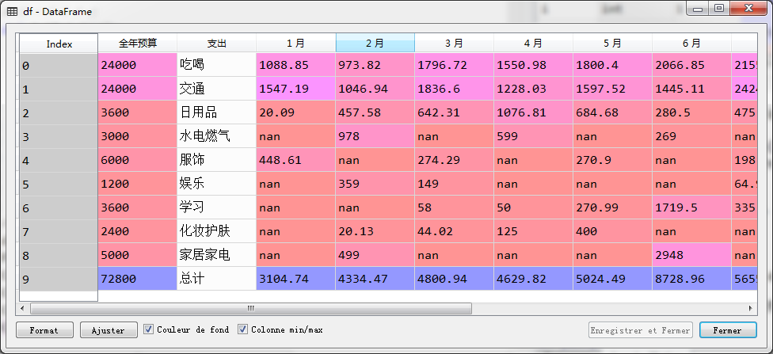
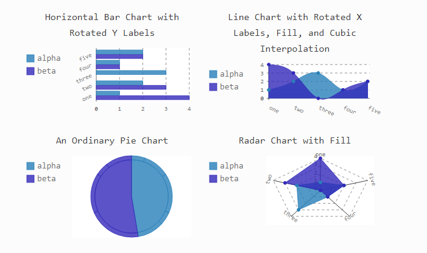
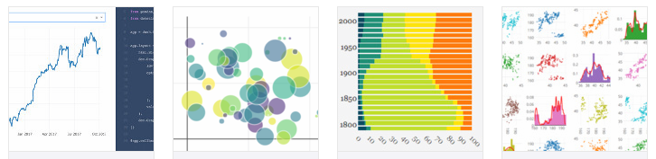
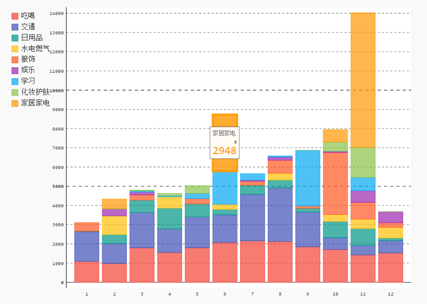
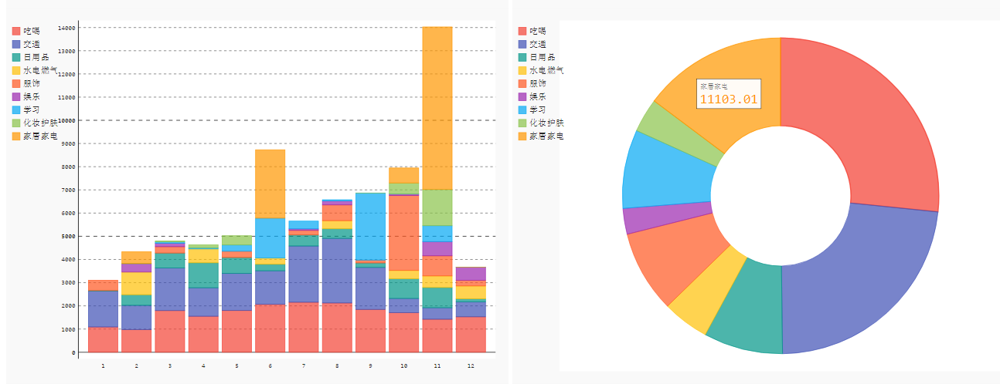
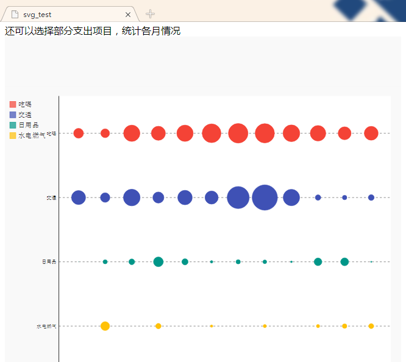
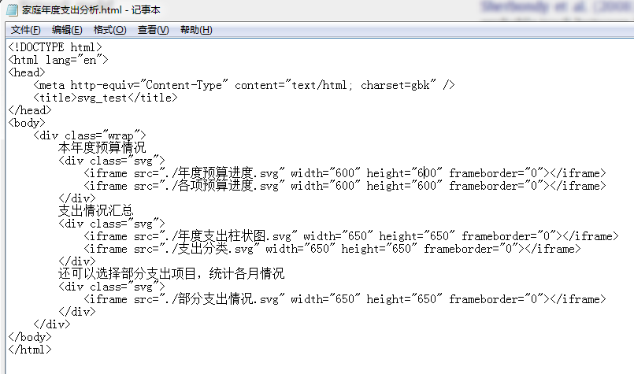

# Python数据可视化：用Pygal统计家庭支出情况

[TOC]

先上成果图，最终会生成这些文件



这是预算效果图



主要分为以下几步：

1、你需要自己记账，有一个Excel表格

2、用Python读取表格，根据需求绘图（包括支出总计、预算等）

3、将图片汇总到网页（你也可以不汇总）

## 准备Excel表格

首先我们需要一个Excel表格，里面有每个月的账单情况

大家可以根据自己的需求调整，没有支出的地方，空着，写0 ，都可以

（里面的数字瞎写的，大家填写自己的实际情况就可以了）



有几点注意：

- 保持首行不变。也就是说，还是按照预算、支出项目、1-12月这个排序。如果你不喜欢把==预算==放在最前面，你想放到最后面，那你需要改代码
- 支出的类别，你可以随意删减或者增加，代码会自动统计行数，然后依次提取
- 注意，最后一行，请留给==总计==。如果你不想要总计，那也需要改代码，因为我代码里，用到了最后一行的数据

## 编写Python代码

### 安装相关库

程序开始之前，你需要安装几个库

还是通过`附件`—`命里提示符`

```python
pip install pandas     # 取读Excel数据
pip install pygal      # 所有的图都靠它
pip install lxml       # 提高图像渲染速度
pip install cairosvg   # 这三个是渲染的库，一次性装好
pip install tinycss    # 这三个是渲染的库，一次性装好
pip install cssselect  # 这三个是渲染的库，一次性装好
```

### 开始写代码

pygal：画图要用

pandas：Excel表格要用

math：用于Excel表格中的空值

````python
import pygal  
import pandas as pd
import math
````

### 取读表格数据

pandas超好用，取读Excel，一句话搞定

```python
df = pd.read_excel('家庭支出清单.xlsx')  #默认读取到Excel的第一个表单
```



### 替换表格中的空数据

记账的时候，这个月没花这个钱，我就会直接空着

在导入表格的时候，就会出现nan(空值)

用math函数替换成0

```python
if math.isnan(data[j]):    
     data[j] = 0
```

`isnan`就是判断，判断是不是nan值

### 根据自己的想法作图

每个人想统计的数据都不同，主要明确2个事情：

1、你想统计什么？比如我就想统计一下支出和预算

2、你喜欢什么样的图？



关于这个，你可以看[Python数据可视化：pygal](https://www.jianshu.com/p/19a4b050fb03)

这里面汇总了所有Pygal的图表以及基本操作（也是本宝宝汇总的）

当然Pygal不是唯一的选择，Bokeha啊，Plotly啊，都超好看




（沉迷于Python可视化，无法自拔……扯远了……）

回到Pygal，根据上面给的链接，你挑选自己喜欢的图的样子，画就行了

当你想感受不同的图表时，你只需要改变第一行的图表类型（比如柱状图和折线图），后面一般不用改，特别方便

```python
# 输出各项支出统计
def PlotItems(df):
    dot_chart = pygal.Dot(x_label_rotation=30)
    #line_chart.title = '每月支出'
    for i in range(0,4):         
        data=df.ix[i].values
        for j in range(2,14):                 
            if math.isnan(data[j]):    
                data[j] = 0          
        dot_chart.add(df.ix[i,1], data[2:len(data)])
    dot_chart.x_labels = map(str, range(1, 13))
    dot_chart.render_to_file("部分支出情况.svg")
    

# 统计各项支出汇总
def SumItems(df,n):
    data=df.ix[n].values
    items = 0
    for i in range(2,14):   
        #  判断Excel表格中的空值nan
        if math.isnan(data[i]):    
            data[i] = 0
        items += float(data[i])    
    return items

# 统计预算进度
def CalBudget(df):
    gauge = pygal.SolidGauge(half_pie=True, inner_radius=0.70, style=pygal.style.styles['default'](value_font_size=10))
    percent_formatter = lambda x: '{:.10g}%'.format(x)    
    gauge.value_formatter = percent_formatter
    #gauge.title = '各项预算进度(%)'
    for i in range(0,len(df)-1): 
        data=df.ix[i].values
        items = SumItems(df,i)        
        items = round(items/data[0]*100,2)    
        gauge.add(df.ix[i,1], items)
    gauge.render_to_file("各项预算进度.svg")

# 统计预算总进度
def CalBudgetTotel(df):
    gauge = pygal.SolidGauge(inner_radius=0.70)
    percent_formatter = lambda x: '{:.10g}%'.format(x)    
    gauge.value_formatter = percent_formatter
    #gauge.title = '年度预算进度(%)'
    i = len(df)-1
    data=df.ix[i].values
    items = SumItems(df,i)        
    items = round(items/data[0]*100,2)    
    gauge.add(df.ix[i,1],items)
    gauge.value_formatter = lambda x: '%.2f%%' % x if x is not None else '∅'
    gauge.render_to_file("年度预算进度.svg")

# 统计支出分类
def CalPie(df):    
    pie_chart = pygal.Pie(inner_radius=.4)
    #pie_chart.title = '支出分类'
    for i in range(0,len(df)-1):         
        items = SumItems(df,i)           
        pie_chart.add(df.ix[i,1], items)
    pie_chart.render_to_file("支出分类.svg")

# 统计所有支出
def CalTotal(df):
    line_chart = pygal.StackedBar()
    #line_chart.title = '每月支出'
    for i in range(0,len(df)-1):         
        data=df.ix[i].values
        for j in range(2,14):                 
            if math.isnan(data[j]):    
                data[j] = 0          
        line_chart.add(df.ix[i,1], data[2:len(data)])
    line_chart.x_labels = map(str, range(1, 13))
    line_chart.render_to_file("年度支出柱状图.svg")
```

### 保存为svg格式

所有的代码，最后都会有一行

```python
***.render_to_file("***.svg")
```

其实这里，我们可以直接保存成png图片格式的

那为什么要保持成svg？因为它会动啊！超可爱的

svg格式，双击之后，是直接在浏览器的

你可以点每一部分，让它给你看结果



你还可以在最左侧，勾选你要的项目，部分显示


总之，超棒的。图片格式就做不到这点

### 运行代码

请右击打开代码，Run运行。不要直接双击`.py`文件。

看看代码再运行，感觉更好哟

也欢迎大家改代码

## 保存到网页

其实到上面一步，我们已经得到所有的图了，为什么还要保存到网页呢？

其实我就是想把结果汇总到一起



在网页上，还可以打字（如下图），虽然以我目前的水平，搞得比较丑



操作也很简单，直接打开一个记事本

把图片写进去，width和height大小随意调整



 保存的时候，把后缀也改掉，改成`html`就可以了

如果你的图改动了，只要文件名不改，就不需要改这个文件

会自动更新哒~

## 最后

可视化真好看，要慢慢学习呀~

and

我要少花一点钱……

我发现，我有点超预算了……