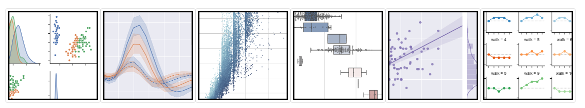
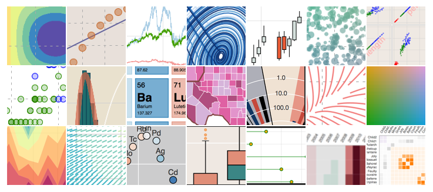

 

##  [matplotlib](https://matplotlib.org/index.html)

|                                                              |                                                              |                                                              |                                                              |
| ------------------------------------------------------------ | ------------------------------------------------------------ | ------------------------------------------------------------ | ------------------------------------------------------------ |
|  |  |  |  |

## [Seaborn](http://seaborn.pydata.org/index.html)

## [ggplot](http://ggplot.yhathq.com/)

|                                                             |                                                              |                                                              |
| ----------------------------------------------------------- | ------------------------------------------------------------ | ------------------------------------------------------------ |
|  |  |  |

## [ Bokeh](http://bokeh.pydata.org/en/latest/)

## pygal

## [Plotly](https://plot.ly/python/)

## [geoplotlib](https://github.com/andrea-cuttone/geoplotlib)

## [Gleam](https://github.com/dgrtwo/gleam)

## [missingno](https://github.com/ResidentMario/missingno)

|                                                              |                                                              |                                                              |
| ------------------------------------------------------------ | ------------------------------------------------------------ | ------------------------------------------------------------ |
|  |  |  |

## [Leather](https://leather.readthedocs.io/en/latest/index.html)

转载自：https://www.cnblogs.com/huangsxj/p/8667850.html